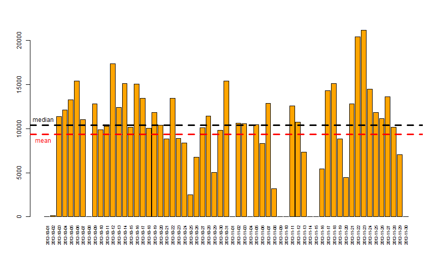
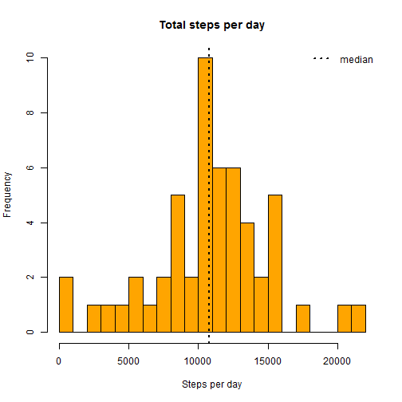
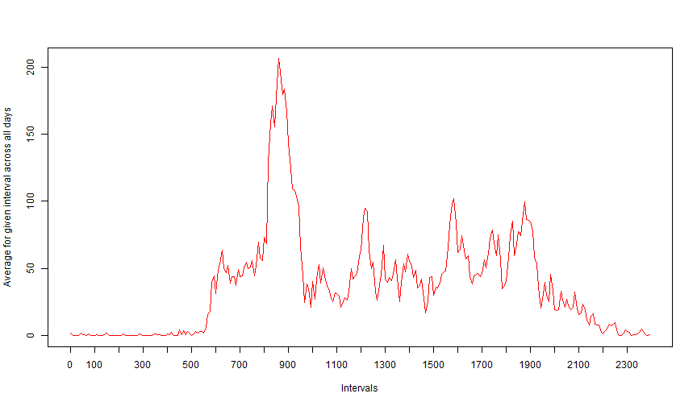
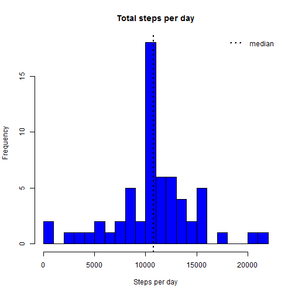
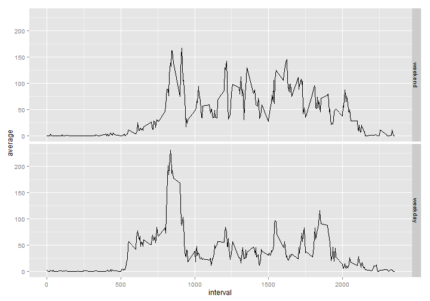

## Loading and preprocessing the data
Unzip data to obtain a csv file.


```r
activity <- read.csv("D:\\ACHU\\NITK\\Online courses\\R\\Reproducible Research\\activity.csv", stringsAsFactors=FALSE)
str(activity)
```

```
## 'data.frame':	17568 obs. of  3 variables:
##  $ steps   : int  NA NA NA NA NA NA NA NA NA NA ...
##  $ date    : chr  "2012-10-01" "2012-10-01" "2012-10-01" "2012-10-01" ...
##  $ interval: int  0 5 10 15 20 25 30 35 40 45 ...
```

```r
summary(activity)
```

```
##      steps            date              interval     
##  Min.   :  0.00   Length:17568       Min.   :   0.0  
##  1st Qu.:  0.00   Class :character   1st Qu.: 588.8  
##  Median :  0.00   Mode  :character   Median :1177.5  
##  Mean   : 37.38                      Mean   :1177.5  
##  3rd Qu.: 12.00                      3rd Qu.:1766.2  
##  Max.   :806.00                      Max.   :2355.0  
##  NA's   :2304
```

Convert date to POSIXct class using lubridate package and convert interval to hour:minute format

```r
library(lubridate)

activity$date <- ymd(activity$date)

str(activity)
```

```
## 'data.frame':	17568 obs. of  3 variables:
##  $ steps   : int  NA NA NA NA NA NA NA NA NA NA ...
##  $ date    : POSIXct, format: "2012-10-01" "2012-10-01" ...
##  $ interval: int  0 5 10 15 20 25 30 35 40 45 ...
```


## What is the average daily activity pattern?
#### 1. Calculate the total number of steps taken per day (ignore the missing values)

```r
require(dplyr)
total_day <- activity %>% group_by(date) %>%summarise(total_steps=sum(steps,na.rm=TRUE),na=mean(is.na(steps))) %>% print
```

```
## Source: local data frame [61 x 3]
## 
##          date total_steps na
## 1  2012-10-01           0  1
## 2  2012-10-02         126  0
## 3  2012-10-03       11352  0
## 4  2012-10-04       12116  0
## 5  2012-10-05       13294  0
## 6  2012-10-06       15420  0
## 7  2012-10-07       11015  0
## 8  2012-10-08           0  1
## 9  2012-10-09       12811  0
## 10 2012-10-10        9900  0
## ..        ...         ... ..
```
Visualise the total number of steps taken per day as a barplot


```r
barplot(height = total_day$total_steps,names.arg=total_day$date,cex.names=0.68,las=3,col="orange")
abline(h=median(total_day$total_steps), lty=2,lwd=3, col="black")
abline(h=mean(total_day$total_steps), lty=2,lwd=3, col="red")
text(x = 0,y=median(total_day$total_steps),pos=3,labels = "median")
text(x = 0,y=mean(total_day$total_steps),pos=1,labels = "mean",col="red")
```

 

####  2. Make a histogram of the total number of steps taken each day

Histogram does not contain days where all observations are missing (i.e. there have to be a number of steps for at least one interval for that day, to be included). Otherwise, there would be about ten days with 0 steps.  

```r
total_day <- filter(total_day, na < 1)
hist(total_day$total_steps,col="orange",breaks=20,main="Total steps per day",xlab="Steps per day")
abline(v=median(total_day$total_steps),lty=3, lwd=2, col="black")
legend(legend="median","topright",lty=3,lwd=2,bty = "n")
```

 

#### 3. Calculate and report the mean and median of the total number of steps taken per day


```r
mean_steps <- mean(total_day$total_steps,na.rm=TRUE)
median_steps <- median(total_day$total_steps,na.rm=TRUE)
```
Mean and median of the total number of steps taken per day are 1.076619 &times; 10<sup>4</sup> steps and 10765 steps, respectively.

## What is the average daily activity pattern?

#### 1. Make a time series plot (i.e. type = "l") of the 5-minute interval (x-axis) and the average number of steps taken, averaged across all days (y-axis)  


```r
library(dplyr,quietly = TRUE)
daily_patterns <- activity %>% group_by(interval) %>% summarise(average=mean(steps,na.rm=TRUE))
plot(x = 1:nrow(daily_patterns),y = daily_patterns$average,type = "l",
     col = "red", xaxt = "n",xlab="Intervals", 
     ylab = "Average for given interval across all days")
axis(1,labels=daily_patterns$interval[seq(1,288,12)],
     at = seq_along(daily_patterns$interval)[seq(1,288,12)])
```

 

#### 2. Which 5-minute interval, on average across all the days in the dataset, contains the maximum number of steps?

```r
max_numb_steps_interval <- filter(daily_patterns,average==max(average))
```

Interval **"835"** contains on average the maximum number of steps (**206.17 steps**).

## Imputing missing values

#### 1. Calculate and report the total number of missing values in the dataset (i.e. the total number of rows with NAs)


```r
na_number <- sum(is.na(activity$steps))
na_number
```

```
## [1] 2304
```

```r
percentage_na <- mean(is.na(activity$steps))
percentage_na
```

```
## [1] 0.1311475
```
Total number of missing values in the dataset amounts to **2304 ** (what is **13.1** % of total observations).

#### 2. Devise a strategy for filling in all of the missing values in the dataset

As the number of missing values in this dataset is fairly large, we cannot be sure if there is no bias introduced by missing values. Therefore we impute missing values based on average number of steps in particular 5-minutes interval. 

#### 3. Create a new dataset that is equal to the original dataset but with the missing data filled in.

```r
without_NAs <- numeric(nrow(activity))
for (i in 1:nrow(activity))
{
        if (is.na(activity[i,"steps"])==TRUE)
            {
                    without_NAs[i]<-filter(daily_patterns,interval==activity[i,"interval"]) %>% select(average)
            } 
        else
            {
                    without_NAs[i]<-activity[i,"steps"]
            }
                    
}
activity_without_NAs<-mutate(activity,steps_no_NAs=without_NAs)
head(activity_without_NAs)
```

```
##   steps       date interval steps_no_NAs
## 1    NA 2012-10-01        0     1.716981
## 2    NA 2012-10-01        5    0.3396226
## 3    NA 2012-10-01       10    0.1320755
## 4    NA 2012-10-01       15    0.1509434
## 5    NA 2012-10-01       20    0.0754717
## 6    NA 2012-10-01       25      2.09434
```

Below code is just to verify if process of imputing missing values correctly preserved original values (lines with no NAs)   

```r
check <- filter(activity_without_NAs,!is.na(steps)) %>% mutate(ok = (steps==steps_no_NAs))
mean(check$ok)
```

```
## [1] 1
```

#### 4. Make a histogram of the total number of steps taken each day and Calculate and report the mean and median total number of steps taken per day


```r
total_day_noNAs <- activity_without_NAs %>% mutate(steps_no_NAs=as.numeric(steps_no_NAs)) %>% group_by(date) %>% summarise(total_steps=sum(steps_no_NAs))
hist(total_day_noNAs$total_steps,col="blue",breaks=20,main="Total steps per day",xlab="Steps per day")
abline(v=median(total_day$total_steps),lty=3, lwd=2, col="black")
legend(legend="median","topright",lty=3,lwd=2,bty = "n")
```

 


```r
summary(total_day_noNAs$total_steps)
```

```
##    Min. 1st Qu.  Median    Mean 3rd Qu.    Max. 
##      41    9819   10770   10770   12810   21190
```

Imputing missing values, mean of the total number of steps taken per day  increased while median decreased,compared to estimates from the first part (ingoring missing values). Imputing missing data resulted in increase of total daily number of steps (instead of each NAs we have average that is always >=0)

## Are there differences in activity patterns between weekdays and weekends?

#### 1. Create a new factor variable in the dataset with two levels – “weekday” and “weekend” indicating whether a given date is a weekday or weekend day


```r
library(lubridate)
is_weekday <-function(date){
        if(wday(date)%in%c(1,7)) result<-"weekend"
        else
                result<-"weekday"
        result
}

activity_without_NAs <- mutate(activity_without_NAs,date=ymd(date)) %>% mutate(day=sapply(date,is_weekday))

table(activity_without_NAs$day)
```

```
## 
## weekday weekend 
##   12960    4608
```

#### 2. Make a panel plot containing a time series plot (i.e. type = "l") of the 5-minute interval (x-axis) and the average number of steps taken, averaged across all weekday days or weekend days (y-axis)


```r
library(ggplot2)
daily_patterns <- activity_without_NAs %>% mutate(day=factor(day,levels=c("weekend","weekday")),steps_no_NAs=as.numeric(steps_no_NAs)) %>% group_by(interval,day) %>% summarise(average=mean(steps_no_NAs))
qplot(interval,average,data=daily_patterns,geom="line",facets=day~.)
```

 
